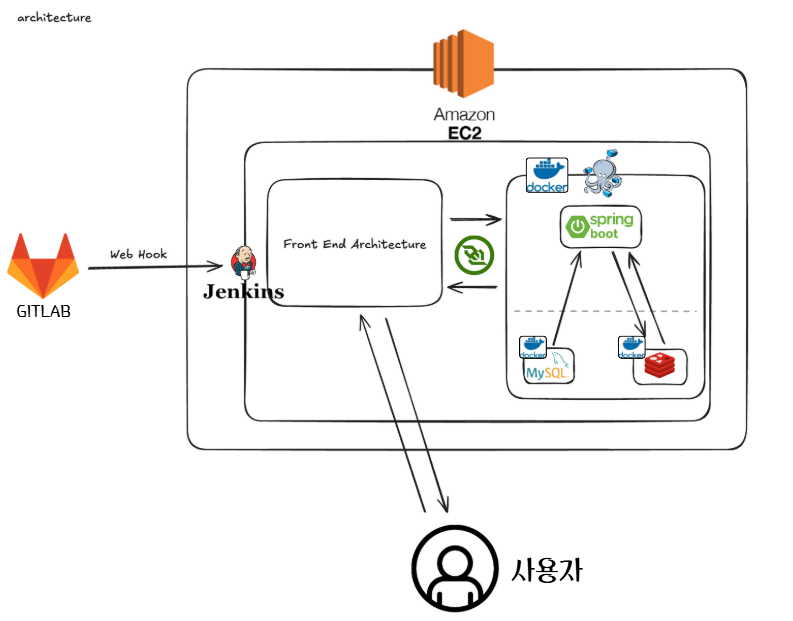

# 🎮 Finble - 실시간 멀티플레이어 경제 보드게임

> 📊 경제 시스템과 3D 그래픽을 결합한 혁신적인 부루마블 스타일 웹 게임

## 📄 목차
- [🎮 Finble - 실시간 멀티플레이어 경제 보드게임](#-finble---실시간-멀티플레이어-경제-보드게임)
  - [📄 목차](#-목차)
  - [✍🏻 프로젝트 개요](#-프로젝트-개요)
    - [기획 의도](#기획-의도)
    - [서비스 소개](#서비스-소개)
  - [🚀 핵심 기능](#-핵심-기능)
  - [⚙️ 기술 스택](#️-기술-스택)
  - [🏛️ 시스템 아키텍처](#️-시스템-아키텍처)
  - [🧡 팀원 소개](#-팀원-소개)
  - [📄 라이선스](#-라이선스)
    - [🎨 리소스 출처](#-리소스-출처)

 

## ✍🏻 프로젝트 개요

**Finble**은 경제 역사를 기반으로 한 실시간 멀티플레이어 보드게임입니다. 플레이어들은 근대사부터 미래까지의 경제 변화 속에서 부동산을 거래하고 투자하여 최고의 부자가 되는 것을 목표로 합니다.

### 기획 의도
- **재미있는 경제 학습:** 딱딱한 경제 개념을 부루마블 형식의 게임에 녹여내어, 플레이어가 자연스럽게 경제 흐름과 투자 전략을 체험하도록 유도합니다.
- **실시간 소통의 즐거움:** 친구, 가족과 함께 즐길 수 있는 실시간 멀티플레이어 환경을 제공하여, 단순한 경쟁을 넘어 소통과 교류의 재미를 더합니다.
- **최신 웹 기술의 적용:** React, Three.js, WebSocket 등 현대적인 웹 기술을 적극적으로 활용하여 풍부한 사용자 경험과 안정적인 서비스를 제공하고자 했습니다.

### 서비스 소개
- **개발 기간:** 2024.08.19 ~ 2024.10.08
- **인원:** 5명
- **서비스 개요:** 실시간 경제 보드게임 웹 플랫폼 'Finble'

 

## 🚀 핵심 기능

> **실시간 멀티플레이어 로비 및 대기실**
>  

> **게임 플레이 영상**
> 
> 

> <b>게임 플레이 주요 기능</b> 
> 실시간 멀티플레이어, 3D 주사위 및 캐릭터 이동, 부동산 거래/건설, 동적 경제 시스템 등 
> Finble의 핵심 게임 플레이를 한눈에 볼 수 있습니다.
> 

 

## ⚙️ 기술 스택
| 파트 | 기술 스택 |
|:---:|:---|
| **Frontend** | `React 19` `TypeScript` `Vite` `Zustand` `React Router v7`   `Three.js` `React Three Fiber` `Rapier3D`   `Material-UI` `Emotion` `Framer Motion` |
| **Backend** | `Java 17` `Spring Boot 3.5.3` `Spring Data JPA` `Spring Security`   `Gradle` `MySQL 8` `Redis` `Lettuce`   `WebSocket (STOMP)` `JWT` `Swagger` |
| **CI/CD & Infra** | `Docker` `Docker-Compose` `Jenkins` `EC2` |

 

## 🏛️ 시스템 아키텍처

 

## 🧡 팀원 소개

| [윤문정](https://github.com/yuuuuuu32) | [김태균](https://github.com/ktg9804287) | [박재연](https://github.com/Park-Jaeyeon) | 박준하 | [하승재](https://github.com/SEUNGJAE-97) |
|:---:|:---:|:---:|:---:|:---:|
|  | |  |  |  |
| 팀장, 프론트, 디자인 | 프론트, 인프라 | 프론트 | 백엔드 | 백엔드 |

 

## 📄 라이선스

본 프로젝트는 MIT 라이선스를 따릅니다. 소스 코드의 사용, 수정, 배포는 자유롭게 가능하나, 원본 출처를 명시해야 합니다.

### 🎨 리소스 출처
- **이미지:** 게임에 사용된 대부분의 일러스트와 배경 이미지는 Midjourney, Stable Diffusion과 같은 생성형 AI 도구를 활용하여 팀에서 직접 생성하였습니다.
- **로고:** 카카오, 구글 등의 로고는 각 서비스의 API를 활용한 기능(소셜 로그인 등)을 명시하기 위한 목적으로만 사용되었습니다.
- **폰트:** [갈무리(Galmuri)](https://noonnu.cc/font_page/1610) 폰트가 사용되었으며, 이는 SIL Open Font License 1.1을 따릅니다.
