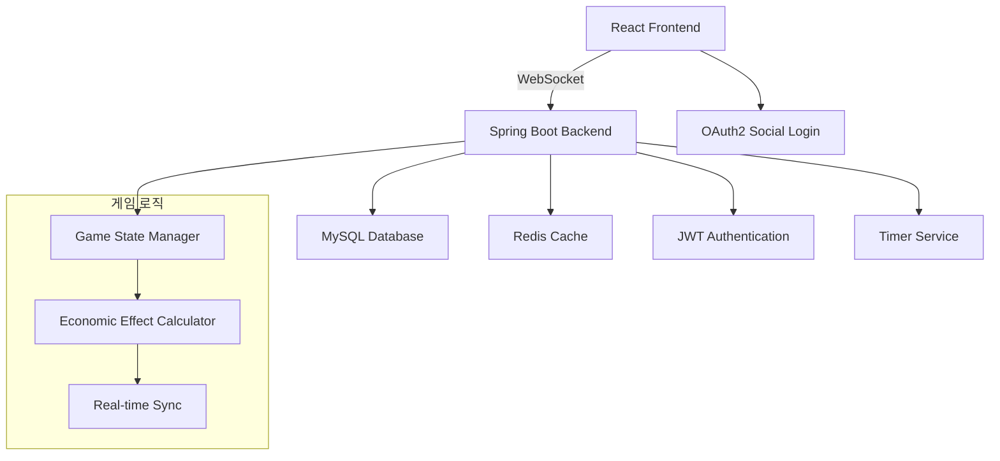

  # 🎮 Finble - 실시간 멀티플레이어 보드게임

> 📊 경제 시스템과 3D 그래픽을 결합한 혁신적인 부루마블 스타일 웹 게임

## 📋 목차
- [🎯 프로젝트 개요](#-프로젝트-개요)
- [✨ 주요 기능](#-주요-기능)
- [🏗️ 시스템 아키텍처](#️-시스템-아키텍처)
- [🔧 기술 스택](#-기술-스택)
- [📂 프로젝트 구조](#-프로젝트-구조)
- [🚀 시작하기](#-시작하기)
- [🎮 게임 시스템](#-게임-시스템)
- [🔄 실시간 통신](#-실시간-통신)
- [📊 경제 시스템](#-경제-시스템)
- [🛠️ 개발 가이드](#️-개발-가이드)

---

## 🎯 프로젝트 개요

**Finble**은 경제 역사를 기반으로 한 실시간 멀티플레이어 보드게임입니다. 플레이어들은 근대사부터 미래까지의 경제 변화 속에서 부동산을 거래하고 투자하여 최고의 부자가 되는 것을 목표로 합니다.

### 🎨 프로젝트 하이라이트
- 🌐 **실시간 멀티플레이어**: 최대 4명 동시 플레이
- 📈 **동적 경제 시스템**: 시대별 호황/불황 사이클
- 🎲 **3D 물리 엔진**: Three.js 기반 3D 주사위 시스템
- 💰 **시각적 피드백**: 플레이어 간 거래 시 동전 애니메이션
- 🏠 **건물 건설 시스템**: 빌라 → 빌딩 → 호텔 업그레이드
- 🎭 **소셜 로그인**: Google, Kakao 연동

---

## ✨ 주요 기능

### 🎮 게임 플레이
- **턴 기반 보드게임**: 주사위를 굴려 이동하며 부동산 거래
- **건물 건설**: 단계적 건물 업그레이드 시스템
- **통행료 시스템**: 다른 플레이어 부동산 방문 시 수수료 지불
- **찬스 카드**: 이슈, 게임카드, 금융정책 등 다양한 이벤트 카드

### 📊 경제 시스템
- **시대별 변화**: 근대사 → 근현대사 → 현대사 → 미래
- **경제 효과**: 각 시대의 호황/불황이 부동산 가격에 영향
- **실시간 가격 변동**: Redis 기반 빠른 가격 계산
- **투자 전략**: 시대 변화를 예측한 투자 게임

### 🌐 멀티플레이어
- **실시간 동기화**: WebSocket 기반 게임 상태 공유
- **방 시스템**: 방 생성 및 참가 (최대 4명)
- **턴 타이머**: 30초 제한 시간으로 빠른 게임 진행
- **실시간 업데이트**: 방 목록 및 플레이어 현황 실시간 반영

### 💰 게임 경제 시스템
- **월급 시스템**: 시작점 통과 시 100만원 기본 월급 (경제 효과 적용)
- **감옥 시스템**: 3턴간 이동 불가, 보석금 50만원으로 즉시 탈출 가능
- **경제 효과**: 시대별 호황/불황이 월급, 부동산 가격, 건설비에 모두 영향

---

## 🏗️ 시스템 아키텍처


```mermaid
graph TB
    A[React Frontend] -->|WebSocket| B[Spring Boot Backend]
    B --> C[MySQL Database]
    B --> D[Redis Cache]
    B --> E[JWT Authentication]
    A --> F[OAuth2 Social Login]
    B --> G[Timer Service]
    
    subgraph "게임 로직"
        H[Game State Manager]
        I[Economic Effect Calculator]
        J[Real-time Sync]
    end
    
    B --> H
    H --> I
    I --> J
```

### 🔄 실시간 게임 플로우
1. **게임 시작**: DB에서 경제 데이터 로드, 호황/불황 셔플
2. **턴 관리**: TimerService에서 시대 변화 감지 및 효과 적용  
3. **실시간 계산**: 이벤트 발생 시 roomId로 현재 효과 조회
4. **캐싱**: 적용된 가격 정보를 Redis에 저장
5. **동기화**: WebSocket으로 모든 플레이어에게 상태 전송

---

## 🔧 기술 스택

### 🎨 Frontend
```json
{
  "framework": "React 19 + TypeScript",
  "build": "Vite",
  "ui": "Material-UI + Emotion",
  "3d": "Three.js + React Three Fiber",
  "physics": "Rapier3D",
  "animation": "Framer Motion",
  "state": "Zustand",
  "routing": "React Router v7",
  "auth": "Google OAuth + Kakao",
  "realtime": "WebSocket + STOMP"
}
```

### ⚙️ Backend  
```json
{
  "framework": "Spring Boot 3.5.3 + Java 17",
  "database": "MySQL 8 + Spring Data JPA",
  "cache": "Redis + Lettuce",
  "security": "Spring Security + JWT",
  "realtime": "WebSocket + STOMP",
  "docs": "Swagger/OpenAPI 3",
  "monitoring": "Spring Actuator",
  "build": "Gradle",
  "deployment": "Docker"
}
```

### 🗄️ 데이터베이스
- **MySQL**: 게임 데이터, 사용자 정보, 결과 저장
- **Redis**: 게임 상태 캐싱, 세션 관리, 실시간 가격 정보

---

## 📂 프로젝트 구조

### 📁 Frontend Structure (Feature-Based)
```
src/
├── 🎯 features/          # 기능별 모듈
│   ├── auth/            # 인증 (로그인, 회원가입)
│   ├── game/            # 게임 메인 로직
│   │   ├── canvas/      # 3D 렌더링
│   │   ├── components/  # UI 컴포넌트
│   │   ├── handlers/    # 게임 로직
│   │   └── store/       # 상태 관리
│   ├── lobby/           # 로비 (방 목록)
│   └── room/            # 대기실
├── 🔧 api/              # API 통신
├── 🎨 assets/           # 정적 자원
├── 🛣️ router/           # 라우팅
└── 🗃️ stores/           # 전역 상태
```

### 📁 Backend Structure (Domain-Driven)
```
com.ssafy.BlueMarble/
├── 🎯 domain/           # 도메인별 모듈
│   ├── auth/           # 인증 도메인
│   ├── game/           # 게임 도메인
│   ├── room/           # 방 관리 도메인
│   ├── user/           # 사용자 도메인
│   └── Timer/          # 타이머 도메인
├── 🌐 websocket/       # WebSocket 통신
├── 🔧 global/          # 전역 설정
└── 📁 resources/       # 설정 파일
```

---

## 🚀 시작하기

### 📋 필수 조건
- **Node.js** 18+ 
- **Java** 17+
- **MySQL** 8+
- **Redis** 6+
- **Git**

### 🔧 환경 설정

#### 1. 레포지토리 클론
```bash
git clone https://github.com/your-repo/finble.git
cd finble
```

#### 2. 백엔드 설정
```bash
cd finble-backend

# application.properties 설정
cp src/main/resources/application.properties.example src/main/resources/application.properties

# 데이터베이스 설정
spring.datasource.url=jdbc:mysql://localhost:3307/finble
spring.datasource.username=your_username  
spring.datasource.password=your_password

# Redis 설정
spring.data.redis.host=localhost
spring.data.redis.port=6379

# 백엔드 실행
./gradlew bootRun
```

#### 3. 프론트엔드 설정
```bash
cd finble-frontend

# 의존성 설치
npm install

# 환경변수 설정
cp .env.example .env
VITE_API_BASE_URL=http://localhost:8080
VITE_GOOGLE_CLIENT_ID=your_google_client_id

# 프론트엔드 실행
npm run dev
```

#### 4. 접속
- **Frontend**: http://localhost:5173
- **Backend API**: http://localhost:8080
- **API 문서**: http://localhost:8080/swagger-ui.html

---

## 🎮 게임 시스템

### 🎲 게임 진행
1. **로그인** → Google/Kakao 소셜 로그인
2. **로비** → 방 생성/참가 (최대 4명)
3. **대기실** → 플레이어 모집 및 게임 시작  
4. **게임** → 턴제 보드게임 플레이 (총 20턴)
5. **결과** → 최종 자산 기준 순위 결정

### 🏠 건물 시스템
```
빈 땅 → 빌라 (기본) → 빌딩 (중급) → 호텔 (최고급)
  ↓       ↓              ↓            ↓
땅값    건물 건설비용    건물 건설비용   건물 건설비용
```

### 🎲 찬스 카드 시스템
- **이슈 카드**: 복권 당첨(+500만원), 사기 피해(-500만원), 세금 납부(현금 15% 차감)
- **게임 카드**: 시작점 이동, 앞으로 3칸, 뒤로 2칸 등 위치 변경
- **금융정책 카드**: 금리 인상/경기 침체(모든 플레이어 현금 감소), 세무조사(자산 하락)

### 💰 통행료 시스템
- **통행료 계산**: 각 땅과 건물의 고유한 통행료 × 경제 효과
- **경제 효과**: 시대별 호황/불황에 따른 가격 변동
- **건물별 차등**: 빌라 < 빌딩 < 호텔 순으로 통행료 증가

---

## 🔄 실시간 통신

### 📡 WebSocket 메시지 타입
```typescript
interface GameMessage {
  type: 'ROLL_DICE' | 'BUY_PROPERTY' | 'BUILD' | 'PAY_TOLL';
  payload: any;
  roomId: string;
  playerId: string;
}
```

### 🔄 게임 상태 동기화
```typescript
// 방 입장
websocket.send({
  type: 'ENTER_ROOM',
  payload: { roomId: number }
});

// 주사위 굴리기
websocket.send({
  type: 'ROLL_DICE',
  payload: { power: number }
});

// 땅 구매
websocket.send({
  type: 'TRADE_LAND',
  payload: { landNum: number, buyerName: string }
});
```

---

## 📊 경제 시스템

### 📈 시대별 경제 효과
| 시대 | 기간 | 특징 | 효과 |
|------|------|------|------|
| 근대사 | 1-2턴 | 산업혁명 시대 | 산업화로 인한 경제 성장 |
| 근현대사 | 3-4턴 | 광란의 20년대 | 대량생산·소비 확산 |
| 현대사 | 5-6턴 | 세계화·IT 혁명 | ICT 기술 발전 |
| 미래 | 7-8턴 | 4차 산업혁명 | AI·로봇·바이오 기술 |

### 💹 가격 변동 시스템
- **경제 시대**: 게임 시작 시 근대사→근현대사→현대사→미래 순 고정
- **호황/불황**: 각 시대별로 랜덤 셔플된 경제 상황
- **실시간 적용**: Redis에서 현재 경제 효과를 조회하여 가격 계산
- **영향 범위**: 땅 구매가, 건물 건설비, 통행료 모두 적용

```java
// 경제 효과 적용 예시
Long actualPrice = economicHistoryService
  .calculatePropertyPriceWithEffect(basePrice, gameTurn);
```

---

## 🛠️ 개발 가이드

### 🏗️ 아키텍처 패턴
- **Frontend**: Feature-Slice Design + Compound Components
- **Backend**: Domain-Driven Design + Layered Architecture
- **State**: Flux Pattern (Zustand) + WebSocket Sync
- **Communication**: REST API + WebSocket + Redis Pub/Sub

### 🧪 테스트 및 개발
```bash
# Frontend 개발 서버
npm run dev              # Vite 개발 서버 실행
npm run build            # 프로덕션 빌드
npm run preview          # 빌드 미리보기

# Backend 개발 서버  
./gradlew bootRun        # Spring Boot 실행
./gradlew test           # 테스트 실행
```

### 📦 배포
```bash
# Docker 빌드 및 배포
docker-compose up -d
```

### 🔧 개발 도구
- **Frontend**: Vite HMR, ESLint, Prettier
- **Backend**: Spring Boot DevTools, Swagger UI
- **Database**: MySQL Workbench, Redis CLI
- **Monitoring**: Spring Actuator, Console Logs

---

## 👥 팀 정보

**SSAFY 11기 특화프로젝트 D106팀**
- **Frontend**: React + TypeScript + Three.js 전문가들
- **Backend**: Spring Boot + Redis + WebSocket 전문가들
- **Game Design**: 경제 시스템 및 게임 밸런싱 전문가들

---

## 📄 라이선스

MIT License - 자유롭게 사용, 수정, 배포 가능합니다.

---

## 🎯 주요 게임 규칙

### 💰 **게임 목표**
- **승리 조건**: 20턴 종료 후 최고 자산(현금 + 부동산 가치) 보유자
- **초기 자금**: 각 플레이어 2,000만원으로 시작

### 🏠 **부동산 시스템** 
- **땅 구매**: 빈 땅 도착 시 해당 땅의 기본 가격으로 구매 가능
- **건물 건설**: 소유한 땅에 빌라→빌딩→호텔 순서로 건설
- **통행료**: 다른 플레이어 소유 땅 도착 시 해당 건물의 통행료 지불

### 📈 **경제 시스템**
- **시대 변화**: 2턴마다 근대사 → 근현대사 → 현대사 → 미래 순환
- **경제 효과**: 각 시대별 호황/불황이 모든 가격에 영향
- **특수 땅**: 광주, 대전, 구미, 부산, 서울 등 건물 건설 불가능한 고가 부동산

---

**🎮 지금 바로 Finble을 플레이하고 경제 왕이 되어보세요!**