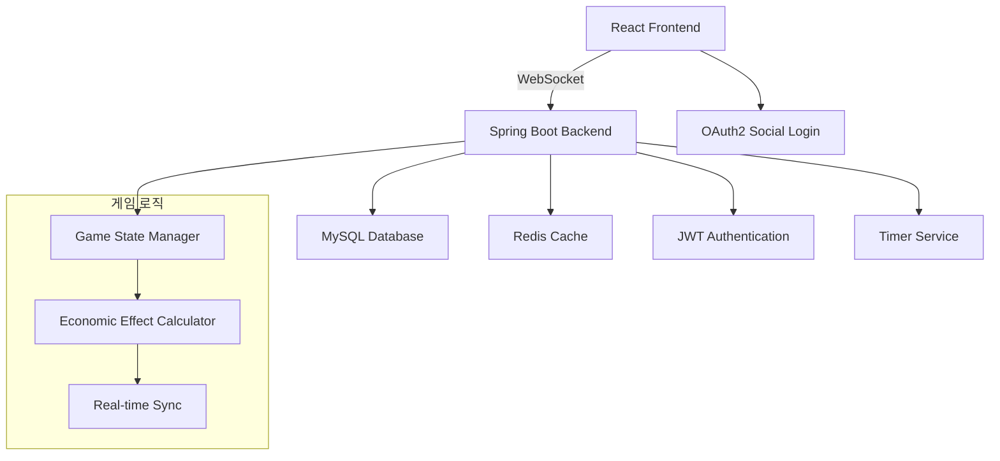

  # 🎮 Finble - 실시간 멀티플레이어 보드게임

> 📊 경제 시스템과 3D 그래픽을 결합한 혁신적인 부루마블 스타일 웹 게임

## 📋 목차
- [🎯 프로젝트 개요](#-프로젝트-개요)
- [✨ 주요 기능](#-주요-기능)
- [🏗️ 시스템 아키텍처](#️-시스템-아키텍처)
- [🔧 기술 스택](#-기술-스택)
- [📂 프로젝트 구조](#-프로젝트-구조)
- [🚀 시작하기](#-시작하기)
- [🎮 게임 시스템](#-게임-시스템)
- [🔄 실시간 통신](#-실시간-통신)
- [📊 경제 시스템](#-경제-시스템)
- [🛠️ 개발 가이드](#️-개발-가이드)

---

## 🎯 프로젝트 개요

**Finble**은 경제 역사를 기반으로 한 실시간 멀티플레이어 보드게임입니다. 플레이어들은 근대사부터 미래까지의 경제 변화 속에서 부동산을 거래하고 투자하여 최고의 부자가 되는 것을 목표로 합니다.

### 🎨 프로젝트 하이라이트
- 🌐 **실시간 멀티플레이어**: 최대 4명 동시 플레이
- 📈 **동적 경제 시스템**: 시대별 호황/불황 사이클
- 🎲 **3D 물리 엔진**: Three.js 기반 3D 주사위 시스템
- 💰 **시각적 피드백**: 플레이어 간 거래 시 동전 애니메이션
- 🏠 **건물 건설 시스템**: 빌라 → 빌딩 → 호텔 업그레이드
- 🎭 **소셜 로그인**: Google, Kakao 연동

---

## ✨ 주요 기능

### 🎮 게임 플레이
- **턴 기반 보드게임**: 주사위를 굴려 이동하며 부동산 거래
- **건물 건설**: 단계적 건물 업그레이드 시스템
- **통행료 시스템**: 다른 플레이어 부동산 방문 시 수수료 지불
- **특수 카드**: 게임 진행을 변화시키는 다양한 이벤트 카드

### 📊 경제 시스템
- **시대별 변화**: 근대사 → 근현대사 → 현대사 → 미래
- **경제 효과**: 각 시대의 호황/불황이 부동산 가격에 영향
- **실시간 가격 변동**: Redis 기반 빠른 가격 계산
- **투자 전략**: 시대 변화를 예측한 투자 게임

### 🌐 멀티플레이어
- **실시간 동기화**: WebSocket 기반 게임 상태 공유
- **방 시스템**: 비공개/공개 방 생성 및 참가
- **턴 타이머**: 30초 제한 시간으로 빠른 게임 진행
- **관전 모드**: 게임 진행 상황 실시간 관람

---

## 🏗️ 시스템 아키텍처


```mermaid
graph TB
    A[React Frontend] -->|WebSocket| B[Spring Boot Backend]
    B --> C[MySQL Database]
    B --> D[Redis Cache]
    B --> E[JWT Authentication]
    A --> F[OAuth2 Social Login]
    B --> G[Timer Service]
    
    subgraph "게임 로직"
        H[Game State Manager]
        I[Economic Effect Calculator]
        J[Real-time Sync]
    end
    
    B --> H
    H --> I
    I --> J
```

### 🔄 실시간 게임 플로우
1. **게임 시작**: DB에서 경제 데이터 로드, 호황/불황 셔플
2. **턴 관리**: TimerService에서 시대 변화 감지 및 효과 적용  
3. **실시간 계산**: 이벤트 발생 시 roomId로 현재 효과 조회
4. **캐싱**: 적용된 가격 정보를 Redis에 저장
5. **동기화**: WebSocket으로 모든 플레이어에게 상태 전송

---

## 🔧 기술 스택

### 🎨 Frontend
```json
{
  "framework": "React 19 + TypeScript",
  "build": "Vite",
  "ui": "Material-UI + Emotion",
  "3d": "Three.js + React Three Fiber",
  "physics": "Rapier3D",
  "animation": "Framer Motion",
  "state": "Zustand",
  "routing": "React Router v7",
  "auth": "Google OAuth + Kakao",
  "realtime": "WebSocket + STOMP"
}
```

### ⚙️ Backend  
```json
{
  "framework": "Spring Boot 3.5.3 + Java 17",
  "database": "MySQL 8 + Spring Data JPA",
  "cache": "Redis + Lettuce",
  "security": "Spring Security + JWT",
  "realtime": "WebSocket + STOMP",
  "docs": "Swagger/OpenAPI 3",
  "monitoring": "Spring Actuator",
  "build": "Gradle",
  "deployment": "Docker"
}
```

### 🗄️ 데이터베이스
- **MySQL**: 게임 데이터, 사용자 정보, 결과 저장
- **Redis**: 게임 상태 캐싱, 세션 관리, 실시간 가격 정보

---

## 📂 프로젝트 구조

### 📁 Frontend Structure (Feature-Based)
```
src/
├── 🎯 features/          # 기능별 모듈
│   ├── auth/            # 인증 (로그인, 회원가입)
│   ├── game/            # 게임 메인 로직
│   │   ├── canvas/      # 3D 렌더링
│   │   ├── components/  # UI 컴포넌트
│   │   ├── handlers/    # 게임 로직
│   │   └── store/       # 상태 관리
│   ├── lobby/           # 로비 (방 목록)
│   └── room/            # 대기실
├── 🔧 api/              # API 통신
├── 🎨 assets/           # 정적 자원
├── 🛣️ router/           # 라우팅
└── 🗃️ stores/           # 전역 상태
```

### 📁 Backend Structure (Domain-Driven)
```
com.ssafy.BlueMarble/
├── 🎯 domain/           # 도메인별 모듈
│   ├── auth/           # 인증 도메인
│   ├── game/           # 게임 도메인
│   ├── room/           # 방 관리 도메인
│   ├── user/           # 사용자 도메인
│   └── Timer/          # 타이머 도메인
├── 🌐 websocket/       # WebSocket 통신
├── 🔧 global/          # 전역 설정
└── 📁 resources/       # 설정 파일
```

---

## 🚀 시작하기

### 📋 필수 조건
- **Node.js** 18+ 
- **Java** 17+
- **MySQL** 8+
- **Redis** 6+
- **Git**

### 🔧 환경 설정

#### 1. 레포지토리 클론
```bash
git clone https://github.com/your-repo/finble.git
cd finble
```

#### 2. 백엔드 설정
```bash
cd finble-backend

# application.properties 설정
cp src/main/resources/application.properties.example src/main/resources/application.properties

# 데이터베이스 설정
spring.datasource.url=jdbc:mysql://localhost:3307/finble
spring.datasource.username=your_username  
spring.datasource.password=your_password

# Redis 설정
spring.data.redis.host=localhost
spring.data.redis.port=6379

# 백엔드 실행
./gradlew bootRun
```

#### 3. 프론트엔드 설정
```bash
cd finble-frontend

# 의존성 설치
npm install

# 환경변수 설정
cp .env.example .env
VITE_API_BASE_URL=http://localhost:8080
VITE_GOOGLE_CLIENT_ID=your_google_client_id

# 프론트엔드 실행
npm run dev
```

#### 4. 접속
- **Frontend**: http://localhost:5173
- **Backend API**: http://localhost:8080
- **API 문서**: http://localhost:8080/swagger-ui.html

---

## 🎮 게임 시스템

### 🎲 게임 진행
1. **로그인** → Google/Kakao 소셜 로그인
2. **로비** → 방 생성/참가 (최대 4명)
3. **대기실** → 플레이어 모집 및 게임 시작
4. **게임** → 턴제 보드게임 플레이
5. **결과** → 순위 및 통계 확인

### 🏠 건물 시스템
```
빈 땅 → 빌라 (기본) → 빌딩 (중급) → 호텔 (최고급)
  ↓       ↓              ↓            ↓
무료    100만원        300만원      500만원
```

### 💰 통행료 계산
- **기본 통행료** = 땅값 × 건물 배율 × 경제 효과
- **건물 배율**: 빈 땅(5%) → 빌라(10%) → 빌딩(20%) → 호텔(30%)
- **경제 효과**: 호황(150%) / 불황(70%)

---

## 🔄 실시간 통신

### 📡 WebSocket 메시지 타입
```typescript
interface GameMessage {
  type: 'ROLL_DICE' | 'BUY_PROPERTY' | 'BUILD' | 'PAY_TOLL';
  payload: any;
  roomId: string;
  playerId: string;
}
```

### 🔄 게임 상태 동기화
```typescript
// 게임 상태 업데이트
websocket.send({
  type: 'GAME_STATE_UPDATE',
  payload: {
    players: [...],
    currentTurn: 'p1',
    economicPhase: 'MODERN',
    board: [...]
  }
});
```

---

## 📊 경제 시스템

### 📈 시대별 경제 효과
| 시대 | 기간 | 특징 | 효과 |
|------|------|------|------|
| 근대사 | 1-5턴 | 산업 발달 | 제조업 지역 호황 |
| 근현대사 | 6-10턴 | 도시화 | 상업 지역 호황 |
| 현대사 | 11-15턴 | IT 혁명 | IT 지역 호황 |
| 미래 | 16-20턴 | 가상 경제 | 전체 지역 변동성 ↑ |

### 💹 가격 변동 알고리즘
```java
// 실시간 가격 계산
public int calculateCurrentPrice(Tile tile, EconomicEffect effect) {
    int basePrice = tile.getBasePrice();
    double economicMultiplier = effect.getMultiplier();
    double regionMultiplier = getRegionMultiplier(tile.getRegion(), effect);
    
    return (int) (basePrice * economicMultiplier * regionMultiplier);
}
```

---

## 🛠️ 개발 가이드

### 🏗️ 아키텍처 패턴
- **Frontend**: Feature-Slice Design + Compound Components
- **Backend**: Domain-Driven Design + Layered Architecture
- **State**: Flux Pattern (Zustand) + WebSocket Sync
- **Communication**: REST API + WebSocket + Redis Pub/Sub

### 🧪 테스트 전략
```bash
# Frontend 테스트
npm run test              # Unit Tests
npm run test:e2e         # E2E Tests

# Backend 테스트  
./gradlew test           # Unit Tests
./gradlew integrationTest # Integration Tests
```

### 📦 배포
```bash
# Docker 빌드 및 배포
docker-compose up -d
```

### 🔧 개발 도구
- **Frontend**: Vite HMR, ESLint, Prettier
- **Backend**: Spring Boot DevTools, Swagger UI
- **Database**: MySQL Workbench, Redis CLI
- **Monitoring**: Spring Actuator, Console Logs

---

## 👥 팀 정보

**SSAFY 11기 특화프로젝트 D106팀**
- **Frontend**: React + TypeScript + Three.js 전문가들
- **Backend**: Spring Boot + Redis + WebSocket 전문가들
- **Game Design**: 경제 시스템 및 게임 밸런싱 전문가들

---

## 📄 라이선스

MIT License - 자유롭게 사용, 수정, 배포 가능합니다.

---

## 🎯 향후 개발 계획

- [ ] 🎴 추가 특수 카드 시스템
- [ ] 🏆 랭킹 및 리더보드
- [ ] 🎨 캐릭터 커스터마이징
- [ ] 📱 모바일 앱 버전
- [ ] 🌍 다국어 지원
- [ ] 🎵 배경 음악 및 효과음

---

**🎮 지금 바로 Finble을 플레이하고 경제 왕이 되어보세요!**