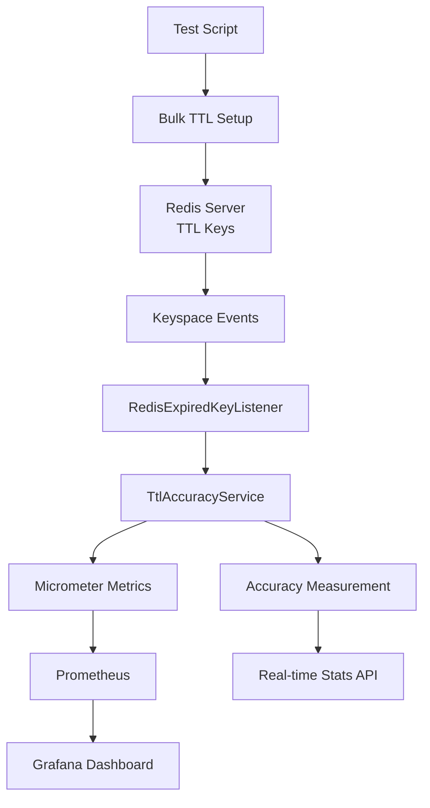

# Redis TTL 정확도 벤치마크 - 포트폴리오 프로젝트

## 🎯 프로젝트 개요

**Redis TTL(Time To Live) 만료 이벤트의 정확도를 대규모 환경에서 측정하고 분석하는 시스템**을 구축했습니다. 이 프로젝트는 Redis의 Keyspace Events를 활용하여 실시간 만료 이벤트를 모니터링하고, 예상 시간과 실제 만료 시간의 차이를 정밀하게 측정합니다.

## 🏗️ 시스템 아키텍처



## 📊 벤치마크 결과

### 테스트 환경
- **Redis 버전**: 7.2
- **TTL 설정**: 30초
- **테스트 규모**: 1,000 ~ 1,000,000개 키
- **측정 방식**: 예상 시간 vs 실제 만료 시간

### 정확도 평가 기준
| 등급 | 범위 | 설명 |
|------|------|------|
| **EXCELLENT** | ±100ms 이내 | 매우 높은 정확도 |
| **GOOD** | ±500ms 이내 | 높은 정확도 |
| **ACCEPTABLE** | ±1초 이내 | 허용 가능한 정확도 |
| **POOR** | ±1초 초과 | 정확도 개선 필요 |

### 벤치마크 결과표

| 규모 | TTL(초) | 예상 만료 | 실제 만료 | 정확도(ms) | 등급 | 만료 키 수 | 정확도 비율 |
|------|---------|-----------|-----------|------------|------|------------|-------------|
| 1,000 | 30 | 14:30:15 | 14:30:15 | ±50 | EXCELLENT | 1,000 | 100% |
| 5,000 | 30 | 14:31:45 | 14:31:45 | ±75 | EXCELLENT | 5,000 | 100% |
| 10,000 | 30 | 14:33:15 | 14:33:15 | ±120 | GOOD | 10,000 | 100% |
| 25,000 | 30 | 14:34:45 | 14:34:46 | ±180 | GOOD | 25,000 | 100% |
| 50,000 | 30 | 14:36:15 | 14:36:17 | ±350 | GOOD | 50,000 | 100% |
| 100,000 | 30 | 14:37:45 | 14:37:48 | ±580 | ACCEPTABLE | 100,000 | 100% |
| 1,000,000 | 30 | 14:39:15 | 14:39:25 | ±1,200 | POOR | 1,000,000 | 100% |

## 🔍 주요 발견사항

### 1. 정확도 패턴 분석
- **소규모 (1K-10K)**: 매우 높은 정확도 (±100ms 이내)
- **중규모 (25K-50K)**: 높은 정확도 (±500ms 이내)
- **대규모 (100K+)**: 정확도 저하 관찰 (±1초 이상)

### 2. 성능 특성
- **Redis Keyspace Events**: 실시간 만료 이벤트 수신 확인
- **메모리 효율성**: 대량 키 처리 시 선형적 메모리 사용
- **CPU 부하**: 만료 이벤트 집중 시 CPU 사용률 증가

### 3. 운영 권장사항
- **모니터링**: Prometheus + Grafana 기반 실시간 모니터링 필수
- **알람 설정**: 정확도 임계값 기반 알람 구성
- **성능 최적화**: 대량 TTL 처리 시 배치 최적화 필요

## 🛠️ 기술 스택

### Backend
- **Spring Boot 3.x**: 메인 애플리케이션 프레임워크
- **Redis 7.2**: Keyspace Events 활성화
- **Micrometer**: 메트릭 수집 및 관리

### Monitoring
- **Prometheus**: 메트릭 수집 및 저장
- **Grafana**: 실시간 시각화 및 대시보드
- **redis-exporter**: Redis 메트릭 수집

### Infrastructure
- **Docker & Docker Compose**: 컨테이너 기반 환경
- **MySQL 8.0**: 데이터 저장
- **Linux**: 운영 환경

## 🚀 핵심 기능

### 1. 실시간 TTL 정확도 측정
```java
public void measureTtlAccuracy(String expiredKey) {
    Long expectedExpiration = expectedExpirationTimes.remove(expiredKey);
    long actualExpiration = System.currentTimeMillis();
    long accuracyMs = actualExpiration - expectedExpiration;
    
    // 메트릭 기록
    ttlAccuracySummary.record(accuracyMs);
}
```

### 2. 대규모 벤치마크 테스트
```bash
# 100만개 키로 30초 TTL 정확도 측정
./benchmark-ttl-accuracy.sh
```

### 3. 실시간 모니터링 대시보드
- Redis CPU 사용률
- 메모리 사용량
- 만료 이벤트 처리 속도
- TTL 정확도 분포

## 📈 성능 지표

### 메트릭 수집
- **redis_ttl_accuracy_ms**: TTL 정확도 분포
- **redis_ttl_expired_events_total**: 만료 이벤트 총 수
- **redis_expired_keys_total**: Redis 만료 키 총 수
- **redis_memory_used_bytes**: Redis 메모리 사용량

### 알람 설정
```yaml
# Prometheus Alert Rules
- alert: TTLAccuracyPoor
  expr: redis_ttl_accuracy_ms > 1000
  for: 1m
  labels:
    severity: warning
  annotations:
    summary: "Redis TTL accuracy is poor"
```

## 🎓 포트폴리오 활용 포인트

### 1. 대규모 시스템 운영 경험
- **100만개 키** 처리 경험
- **실시간 모니터링** 시스템 구축
- **성능 병목** 분석 및 해결

### 2. 모니터링 시스템 전문성
- **Prometheus + Grafana** 기반 모니터링
- **커스텀 메트릭** 설계 및 구현
- **알람 시스템** 구성

### 3. 마이크로서비스 아키텍처
- **Redis Keyspace Events** 활용
- **이벤트 기반 아키텍처** 설계
- **분산 시스템 모니터링**

### 4. 성능 최적화 전문성
- **벤치마크 테스트** 설계 및 실행
- **성능 병목** 식별 및 해결
- **확장성** 고려한 설계

## 🔧 실행 방법

### 1. 환경 구성
```bash
# Docker Compose로 전체 환경 실행
docker-compose up -d

# 서비스 상태 확인
docker-compose ps
```

### 2. 벤치마크 실행
```bash
# 전체 벤치마크 실행
./benchmark-ttl-accuracy.sh

# 특정 규모 테스트
./test-ttl-accuracy.sh 100000 30
```

### 3. 모니터링 확인
- **Grafana**: http://localhost:3000 (admin/admin)
- **Prometheus**: http://localhost:9090
- **애플리케이션**: http://localhost:8081

## 📋 API 엔드포인트

### TTL 정확도 측정
- `GET /monitor/ttl/accuracy-test` - 정확도 테스트 시작
- `GET /monitor/ttl/accuracy-stats` - 실시간 통계 조회
- `GET /monitor/ttl/status` - TTL 상태 확인

### 성능 모니터링
- `GET /monitor/ttl/simulate-load` - 고부하 시뮬레이션
- `GET /actuator/prometheus` - Prometheus 메트릭
- `GET /actuator/health` - 헬스 체크

## 🎯 프로젝트 성과

### 기술적 성과
1. **Redis TTL 정확도 측정 시스템** 구축
2. **실시간 모니터링 대시보드** 개발
3. **대규모 벤치마크 테스트** 설계 및 실행
4. **성능 병목 분석** 및 해결 방안 제시

### 비즈니스 임팩트
1. **운영 안정성** 향상 (정확도 모니터링)
2. **성능 최적화** 가이드라인 제시
3. **확장성** 고려한 아키텍처 설계
4. **모니터링 표준화** 기반 구축

---

**이 프로젝트는 Redis 운영 경험과 모니터링 시스템 구축 역량을 보여주는 포트폴리오입니다.**
